# Windows Server & SecOps Lab: Od Help Desku do Blue Teamu

**Wprowadzenie:** 
Projekt **Active-Directory-HelpDesk-HomeLab** to moje autorskie środowisko domenowe oparte na Windows Server 2022 oraz Windows 10. \
Stworzyłem ten projekt, aby przekuć wiedzę akademicką z zakresu administracji i cyberbezpieczeństwa w realne umiejętności wymagane na stanowiskach IT Support / SysAdmin oraz w zespołach SOC (Security Operations Center). \
Zbudowałem od podstaw infrastrukturę sieciową (AD, DNS, DHCP), zautomatyzowałem procesy za pomocą PowerShella i GPO, a następnie przeprowadziłem kontrolowane ataki (Red Team) i wdrożyłem autorski system detekcji intruzów (Blue Team).

> 💡 **Wskazówka:** GitHub po cofnięciu strony domyślnie zwija wszystkie otwarte sekcje. Aby wygodnie przeglądać galerie zdjęć (zrzuty ekranu), polecam klikać w nie **środkowym przyciskiem myszy (scrollem)**, by otworzyć je w nowej karcie.

Poniższe diagramy przedstawiają architekturę sieciową oraz przepływ pracy w projekcie.

---

<b>🌐 Architektura Infrastruktury i Sieci</b>

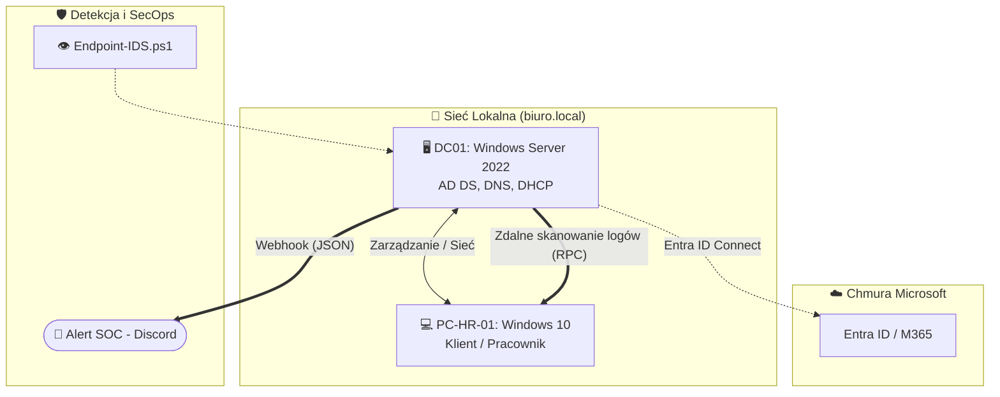
```mermaid
graph TD
    subgraph LAN ["🏢 Sieć Lokalna (biuro.local)"]
        direction TB
        DC["🖥️ DC01: Windows Server 2022<br>AD DS, DNS, DHCP"]
        PC["💻 PC-HR-01: Windows 10<br>Klient / Pracownik"]
        
        DC <-->|"Zarządzanie / Sieć"| PC
    end

    subgraph Cloud ["☁️ Chmura Microsoft"]
        Entra["Entra ID / M365"]
    end

    subgraph BlueTeam ["🛡️ Detekcja i SecOps"]
        IDS["👁️ Endpoint-IDS.ps1"]
        Discord(["💬 Alert SOC - Discord"])
    end

    DC -.->|"Entra ID Connect"| Entra
    DC == "Zdalne skanowanie logów (RPC)" ==> PC
    DC ==>|"Webhook (JSON)"| Discord
    IDS -.-> DC
```

---

<b>🗺️ ROADMAP Projektu </b>

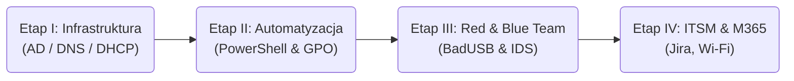
```mermaid
flowchart LR

A("Etap I: Infrastruktura \n(AD / DNS / DHCP)") 
--> 
B("Etap II: Automatyzacja \n(PowerShell & GPO)")
--> 
C("Etap III: Red & Blue Team \n(BadUSB & IDS)")
-->
D("Etap IV: ITSM & M365 \n(Jira, Wi-Fi)")
```

---

<b>🏗️ ETAP I: Infrastruktura i Sieci (Windows Server)</b>

Zaprojektowanie i wdrożenie fundamentów bezpiecznej sieci korporacyjnej. Etap ten dowodzi zrozumienia modelu klient-serwer oraz zarządzania tożsamością i uprawnieniami (RBAC).

**🎯 Cel** \
Zbudowanie wirtualnego biurowca z centralnym zarządzeniem. Skonfigurowanie kontrolera domeny, zautomatyzowanie przydzielania adresów IP oraz wdrożenie bezpiecznej struktury plików.

**🛠️ Wykorzystane Technologie** \
`Windows Server 2022`, `Windows 10`, `Active Directory (AD DS)`, `DNS`, `DHCP`, `NTFS`

**🚀 Kluczowe wdrożenia**
* **Infrastruktura Sieciowa:** Instalacja systemu Windows Server, konfiguracja statycznej adresacji IP (TCP/IPv4) oraz instalacja kluczowych ról Menedżera Serwera (AD DS, DNS).
* **Struktura Organizacyjna:** Zaprojektowanie i wdrożenie jednostek organizacyjnych (OU: IT, HR, Zarząd) zamiast domyślnych kontenerów, co pozwala na precyzyjne skalowanie i nakładanie polis.
* **Automatyzacja Sieci (DHCP):** Uruchomienie i autoryzacja serwera DHCP. Klient z Windows 10 z sukcesem pobiera dzierżawę adresu z przypisanej puli (10.0.0.x) i poprawnie rozwiązuje nazwy domenowe (DNS).
* **Zarządzanie Dostępem (RBAC):** Utworzenie lokalnych grup zabezpieczeń oraz wdrożenie współdzielonego dysku sieciowego. Pomyślna konfiguracja uprawnień NTFS (dostęp do folderów wyłącznie dla autoryzowanych grup docelowych).

<b>📸 Proof of Work</b>

**1. Konfiguracja Serwera i Usług Katalogowych**
> Ustawienie statycznego interfejsu sieciowego oraz uruchomienie podstawowych ról domeny.

 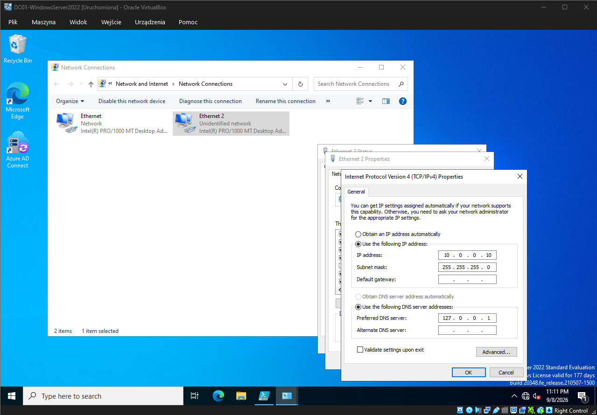
 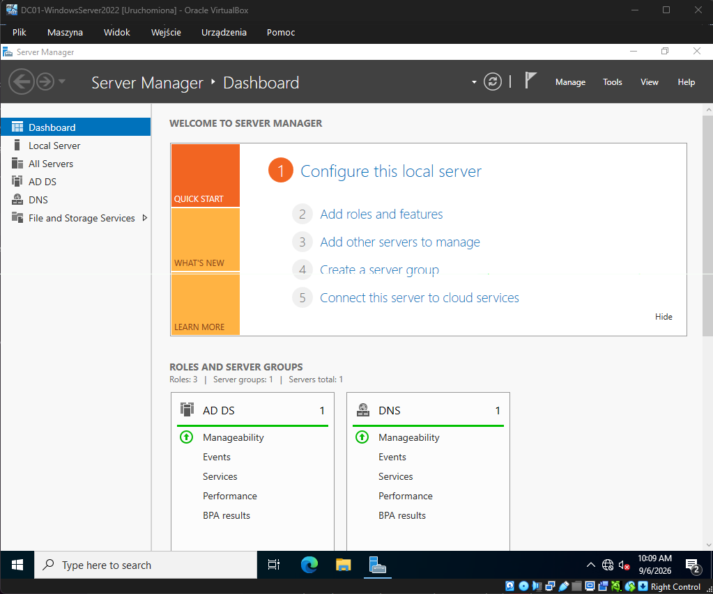

**2. Zarządzanie Tożsamością i Adresacją (DHCP)**
> Utworzenie logicznej struktury organizacyjnej (OUs) w konsoli ADUC oraz widok puli adresowej działającego serwera DHCP.

  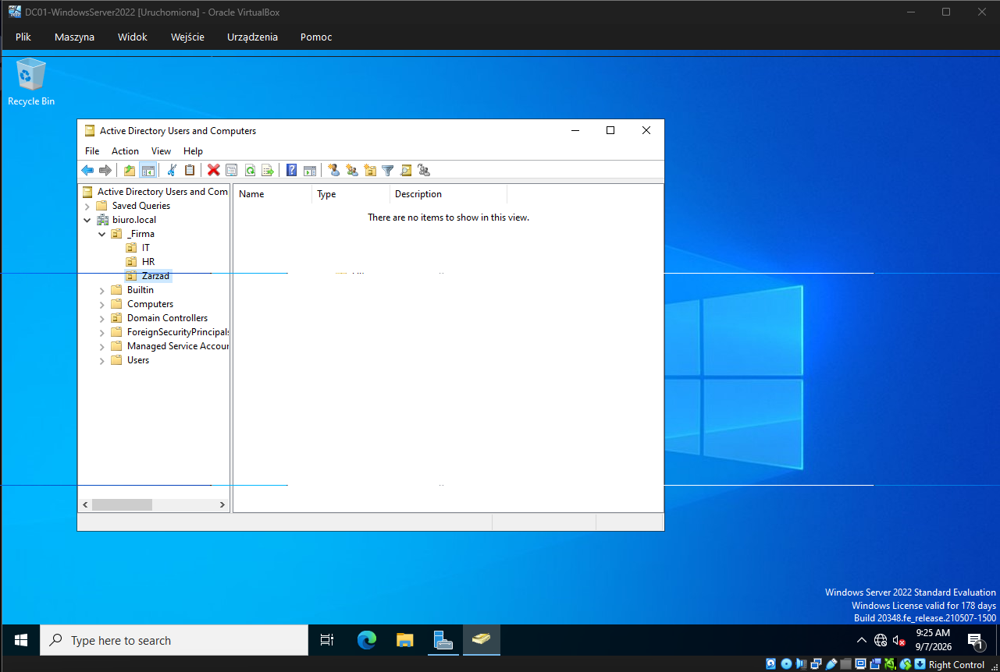
  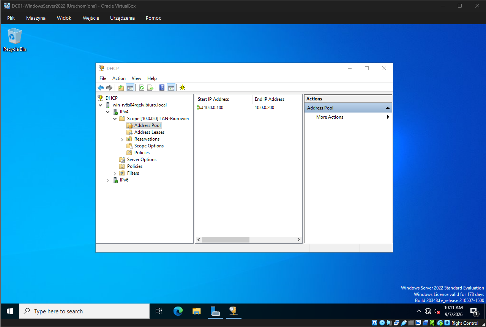

**3. Testy Klienckie (Stacja Robocza Windows 10)**
> Weryfikacja działania sieci z poziomu klienta: pobranie adresu z DHCP, pomyślne dołączenie stacji do domeny `biuro.local` oraz test weryfikujący działanie uprawnień do folderów sieciowych (NTFS).

  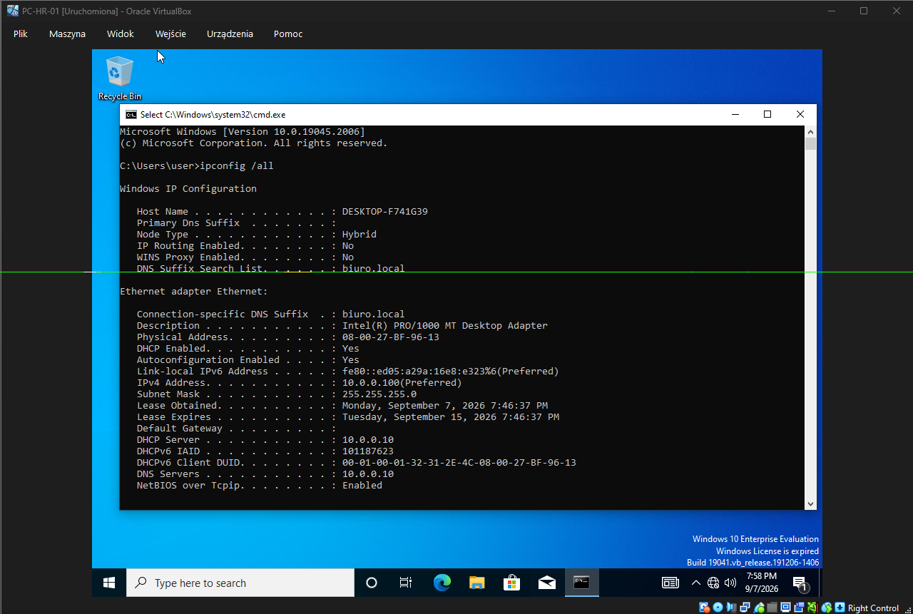
  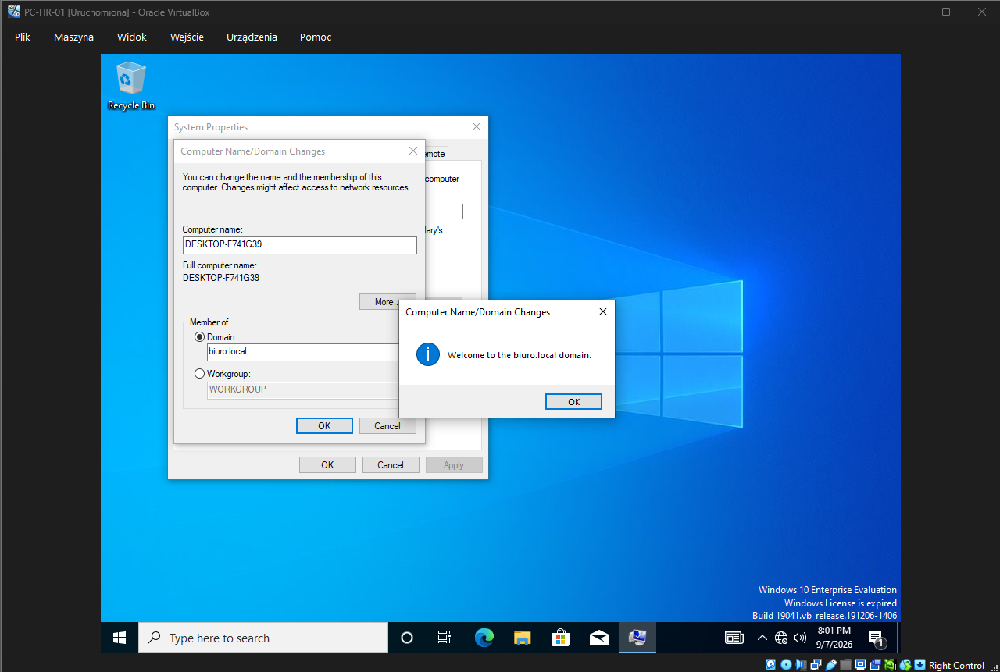
  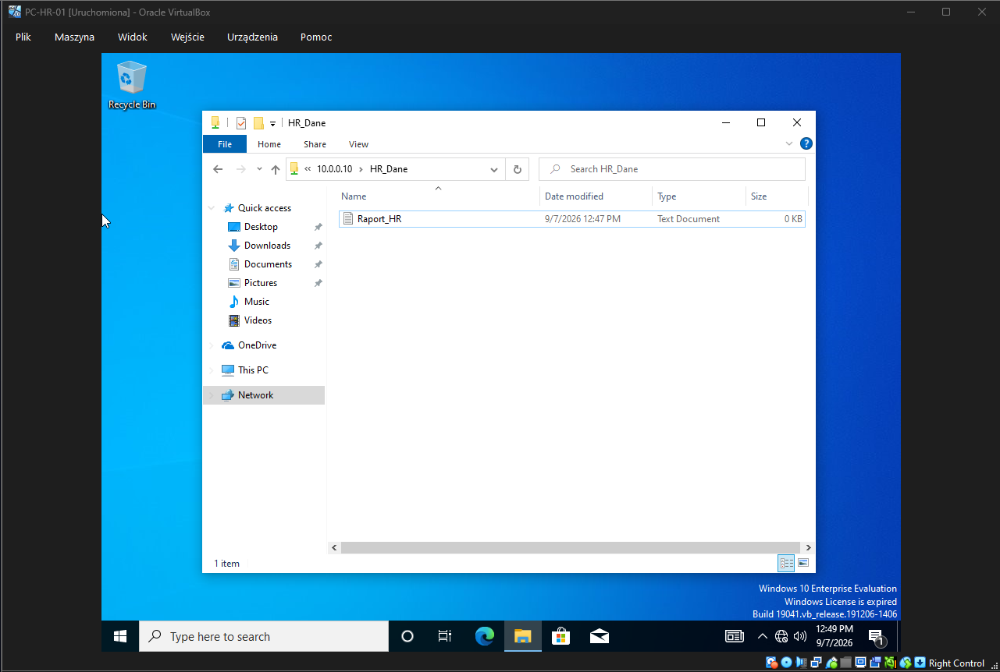

---

<b>⚙️ ETAP II: Automatyzacja, GPO i Chmura (Hybrid AD)</b>

Zastąpienie manualnych czynności administracyjnych zautomatyzowanymi skryptami oraz integracja lokalnego kontrolera domeny z chmurą Microsoftu.

**🎯 Cel** \
Masowe wdrażanie danych nowych użytkowników z plików danych, standaryzacja środowiska stacji roboczych poprzez reguły GPO, synchronizacja hybrydowa do Entra ID (M365) oraz wdrożenie monitoringu krytycznych grup administracyjnych.

**🛠️ Wykorzystane Technologie** \
`PowerShell`, `Group Policy Objects (GPO)`, `Microsoft Entra ID Connect`, `Microsoft 365 Admin Center`, `Discord Webhooks API`

**🚀 Kluczowe wdrożenia**
* **Masowy Onboarding (Create-BulkUsers.ps1):** Automatyzacja procesu Help Desk – skrypt parsuje plik `.csv` i za pomocą `New-ADUser` tworzy konta w odpowiednich jednostkach organizacyjnych (OU), generuje bezpieczne hasła startowe i przypisuje użytkowników do docelowych grup uprawnień.
* **Standaryzacja Środowiska Pracy (GPO):** Opracowanie polityk grupowych: automatyczne mapowanie dysku sieciowego `Z:\` (`Drive Maps`) oraz centralne wymuszenie korporacyjnej tapety pulpitu dla wszystkich stacji w domenie z blokadą jej zmiany.
* **Tożsamość Hybrydowa (Entra ID):** Konfiguracja narzędzia `Microsoft Entra Connect` i pomyślna synchronizacja  użytkowników z lokalnego Active Directory do portalu Microsoft 365 Admin Center w chmurze.
* **Nadzór nad Uprawnieniami Uprzywilejowanymi:** Opracowanie skryptu monitorującego (`Monitor-Admins.ps1`), który weryfikuje skład grupy `Domain Admins` i w przypadku wykrycia nieautoryzowanego członka natychmiast wysyła alert przez Webhook Discorda.

<b>📸 Proof of Work</b>

**1. Automatyzacja tworzenia kont z pliku CSV**
> Wykonanie skryptu `Create-BulkUsers.ps1` w PowerShell ISE oraz zweryfikowanie nowo utworzonych kont i grup w konsoli ADUC.

  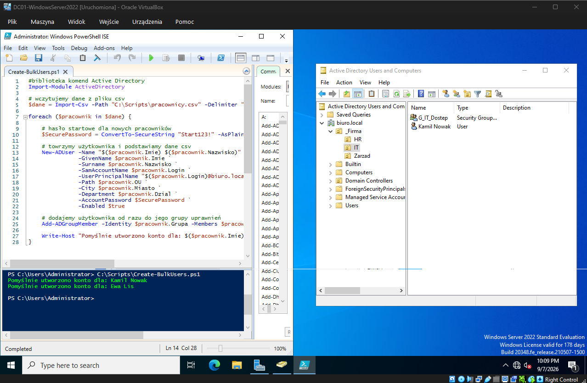

**2. Wymuszenie konfiguracji stacji przez GPO**
> Skonfigurowana polityka mapowania dysków sieciowych oraz wymuszenia tła pulpitu wraz z potwierdzeniem zastosowania na kliencie Windows 10.

  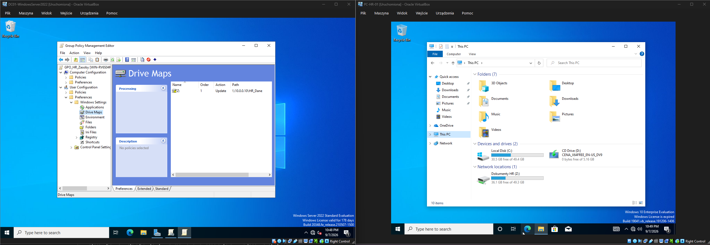

  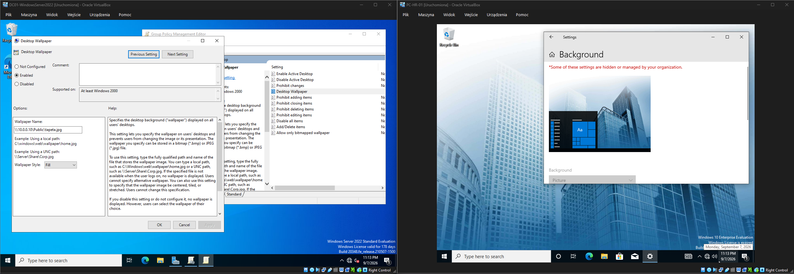

**3. Synchronizacja Hybrydowa i Monitoring Uprawnień**
> Pomyślne zakończenie kreatora konfiguracji Entra ID Connect i widok zsynchronizowanych kont w M365, niżej alert Discord generowany przez skrypt `Monitor-Admins.ps1`.

  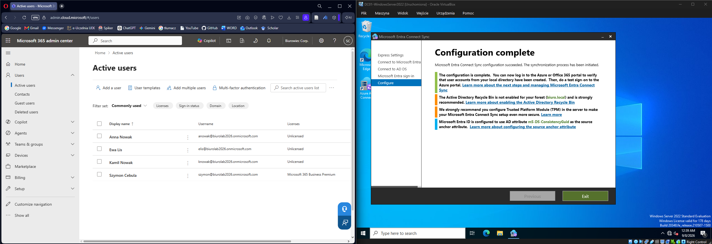

  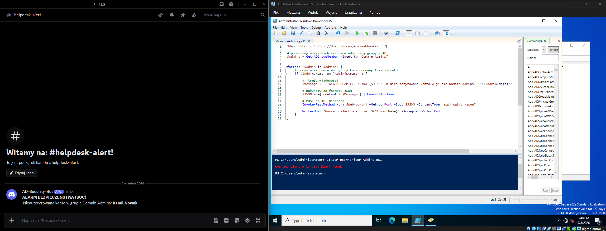

---

<b>🔥 ETAP III: Cyberbezpieczeństwo (Red Team & Blue Team)</b>

Kulminacyjny etap projektu, koncentrujący się na analizie zagrożeń oraz monitoringu. Przeprowadzenie symulacji fizycznego ataku, cyfrowa śledczość w logach oraz zaimplementowanie autorskiego, zdalnego systemu detekcji intruzów typu Enterprise.

**🎯 Cel**\
Zrozumienie, jak odbywają się ataki z pominięciem zabezpieczeń sieciowych (zagrożenia wewnętrzne), poszukiwanie śladów kompromitacji (IoC) w dziennikach zdarzeń i wdrożenie systemu klasy IDS do aktywnego alertowania.

**🛠️ Wykorzystane Technologie**\
`PowerShell`, `Event Viewer (WinEvent)`, `BadUSB (DuckyScript / Hardware HID)`, `Discord Webhooks API`

**🚀 Kluczowe wdrożenia**
* **Obsługa Zgłoszenia L1 i Śledczość w Logach:** Symulacja zablokowania konta użytkownika (5-krotne błędne hasło wymuszone przez Account Lockout Policy), analiza zdarzenia nieudanego logowania w Podglądzie Zdarzeń (**Event ID 4625**) oraz odblokowanie tożsamości za pomocą cmdletu `Unlock-ADAccount`.
* **Symulacja USB Drop (Baiting) / Red Team:** Weryfikacja słabości czynnika ludzkiego poprzez test fizyczny. Przykład podłączenia nieznanego pendrive'a przez administratora. Wykorzystanie ładunku BadUSB wstrzykującego polecenia powłoki w celu utworzenia ukrytego konta lokalnego i dodania go do wbudowanej grupy administratorów (`S-1-5-32-544`).
* **Włączenie Zaawansowanego Audytu (GPO):** Centralne wymuszenie na stacjach roboczych polisy inspekcji zdarzeń bezpieczeństwa, pozwalające systemowi na logowanie Event ID 4732 (Dodanie członka do lokalnej grupy).
* **Enterprise IDS (Blue Team):** Napisanie zaawansowanego skryptu (`Endpoint-IDS.ps1`), operującego na serwerze głównym. Skrypt pobiera z Active Directory listę stacji roboczych (`Get-ADComputer`), łączy się z nimi przez protokół RPC i filtruje logi Security za pomocą `Get-WinEvent`.
* **Alerting:** Skrypt IDS precyzyjnie parsuje właściwości obiektów (wyciągając SID, nazwy grup) i wysyła JSON Payload na dedykowany kanał SOC w Discordzie.

<b>📸 Proof of Work</b>

**1. Obsługa incydentu blokady konta (Help Desk L1) i śledztwo w logach**
> Blokada konta po przekroczeniu limitu prób logowania, odblokowanie konta w ADUC i przez PowerShell oraz szczegółowa analiza zdarzenia Event ID 4625 w Podglądzie Zdarzeń.

  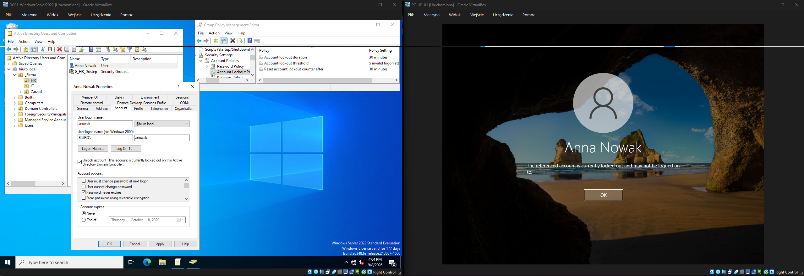

  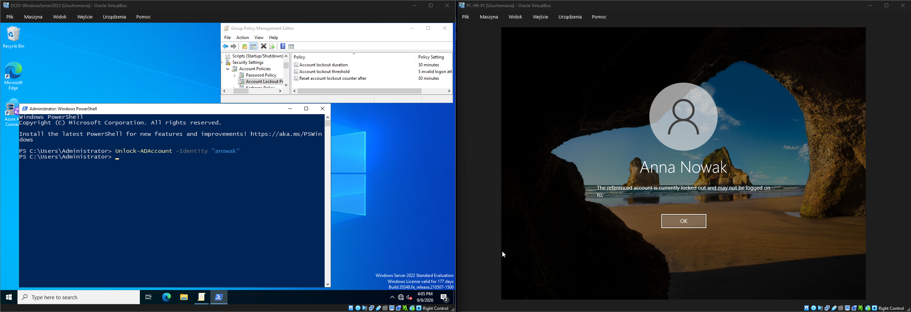

  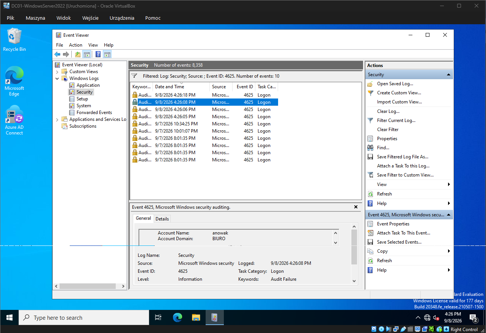

**2. Symulacja ataku Red Team (USB Drop / Backdoor)**
> Weryfikacja skuteczności ataku fizycznego: konto `SerwisIT` pomyślnie dodane do grupy lokalnych administratorów (`S-1-5-32-544`) na stacji roboczej.

  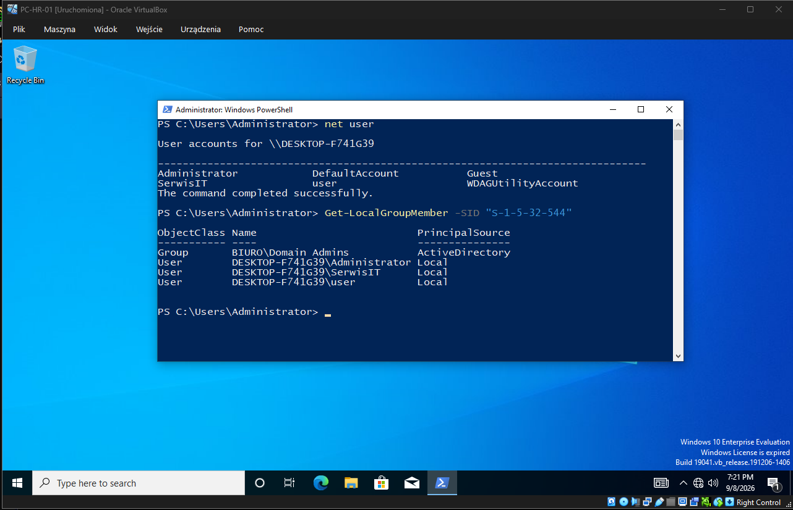

**3. Aktywna Detekcja Blue Team (Enterprise IDS)**
> Skrypt `Endpoint-IDS.ps1` wykonujący zdalny skan stacji domenowych przez RPC oraz sformatowany alert o eskalacji uprawnień dostarczony w czasie rzeczywistym na kanał Discord.

  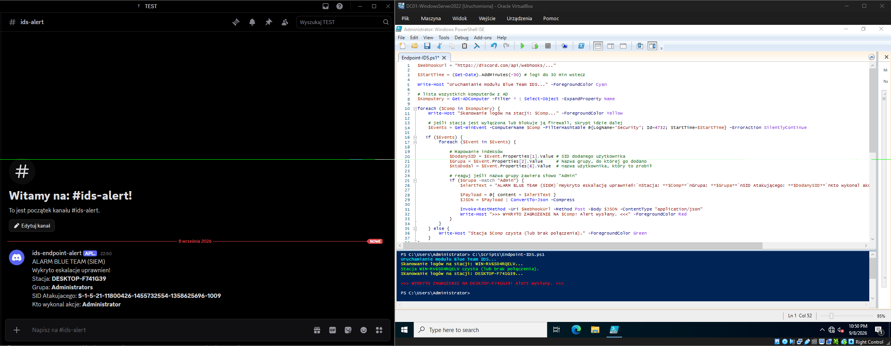

---

<b>💼 ETAP IV: Modern Workplace, ITSM i Wsparcie Sieciowe</b>

Dostosowanie środowiska do standardów nowoczesnego wsparcia użytkownika (Help Desk / Service Desk). Symulacja obsługi realnych zgłoszeń w systemie ticketowym, administracja usługami chmurowymi oraz konfiguracja stacji końcowych.

**🎯 Cel**\
Udokumentowanie umiejętności wymaganych w codziennej pracy Młodszego Specjalisty IT: pracy z systemem ITSM, zarządzania licencjami Microsoft 365 oraz znajomości konfiguracji sieci bezprzewodowych (Wi-Fi) w systemach Windows.

**🛠️ Wykorzystane Technologie**\
`Jira Service Management (ITSM)`, `Microsoft 365 Admin Center`, `Entra ID`, `PowerShell (netsh / WLAN)`

**🚀 Kluczowe wdrożenia**
* **Obsługa Zgłoszeń (ITSM):** Utworzenie instancji Jira Service Management i skonfigurowanie projektu Help Desk. Przejście przez pełen cykl życia zgłoszenia serwisowego (Service Request) – od rejestracji, przez przypisanie i zmianę statusu (In Progress), aż po dodanie komentarza technicznego i zamknięcie ticketu (Resolved) zgodnie z dobrymi praktykami.
* **Administracja Microsoft 365:** Rozwiązanie pierwszej części zgłoszenia poprzez zarządzanie zsynchronizowaną tożsamością w portalu chmurowym. Pomyślne przypisanie licencji *Microsoft 365 Business Premium* nowemu użytkownikowi, zapewniające mu dostęp do pakietu Office, Exchange i Teams.
* **Wsparcie Sieciowe i Automatyzacja (Wi-Fi):** Rozwiązanie drugiej części zgłoszenia poprzez napisanie skryptu PowerShell (`Deploy-WiFiProfile.ps1`). Skrypt bezdotykowo wdraża firmowy profil sieci bezprzewodowej na stacjach roboczych.
* **Tolerancja na Błędy i OPSEC:** Skrypt sieciowy dynamicznie generuje strukturę XML dla protokołu WPA2-PSK (AES), po czym wstrzykuje profil do ustawień Windows przez powłokę `netsh`. Został wyposażony w mechanizmy *Error Handlingu* (przechwytywanie błędu braku fizycznej karty WLAN w środowisku wirtualnym) oraz dbałość o OPSEC (automatyczne i trwałe usuwanie tymczasowego pliku XML z hasłem po instalacji).

<b>📸 Proof of Work</b>

**1. Obsługa systemu ticketowego (Jira Service Management)**
> Podjęcie zgłoszenia dotyczącego onboardingu nowego pracownika. Widoczny profesjonalny opis wymagań oraz przypisanie ticketu do realizatora wraz z odpowiednim statusem.

  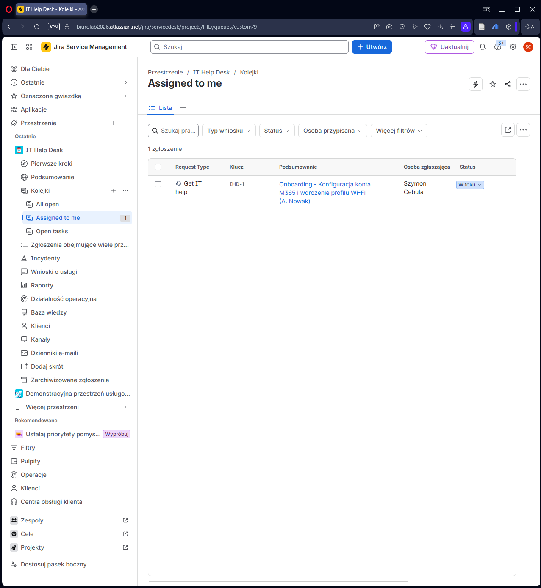

**2. Zarządzanie chmurą Microsoft 365**
> Poprawne przypisanie wymaganej licencji (Business Premium) zsynchronizowanemu użytkownikowi w portalu administracyjnym M365.

  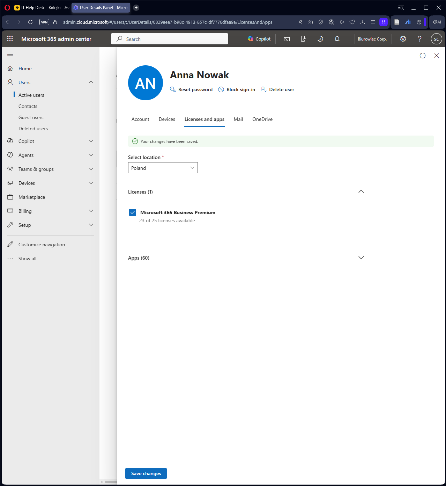

**3. Konfiguracja sieci (Skrypt PowerShell Wi-Fi)**
> Pomyślne wykonanie skryptu wdrażającego profil sieciowy, udokumentowane powiadomieniem o przechwyceniu błędu (wynikającym z pracy na maszynie wirtualnej) oraz skutecznym zatarciu śladów po pliku konfiguracyjnym.

  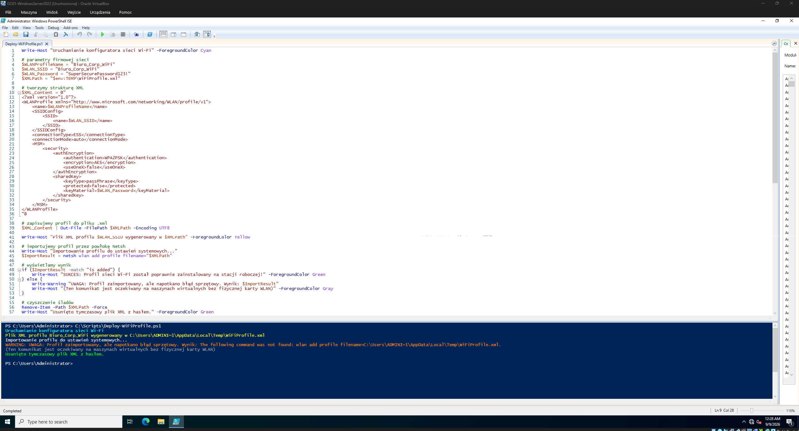

**4. Zamknięcie zgłoszenia**
> Pomyślne rozwiązanie i zamknięcie zgłoszenia serwisowego wraz z dodaniem podsumowującego komentarza technicznego informującego użytkownika (HR) o zrealizowanych krokach.

  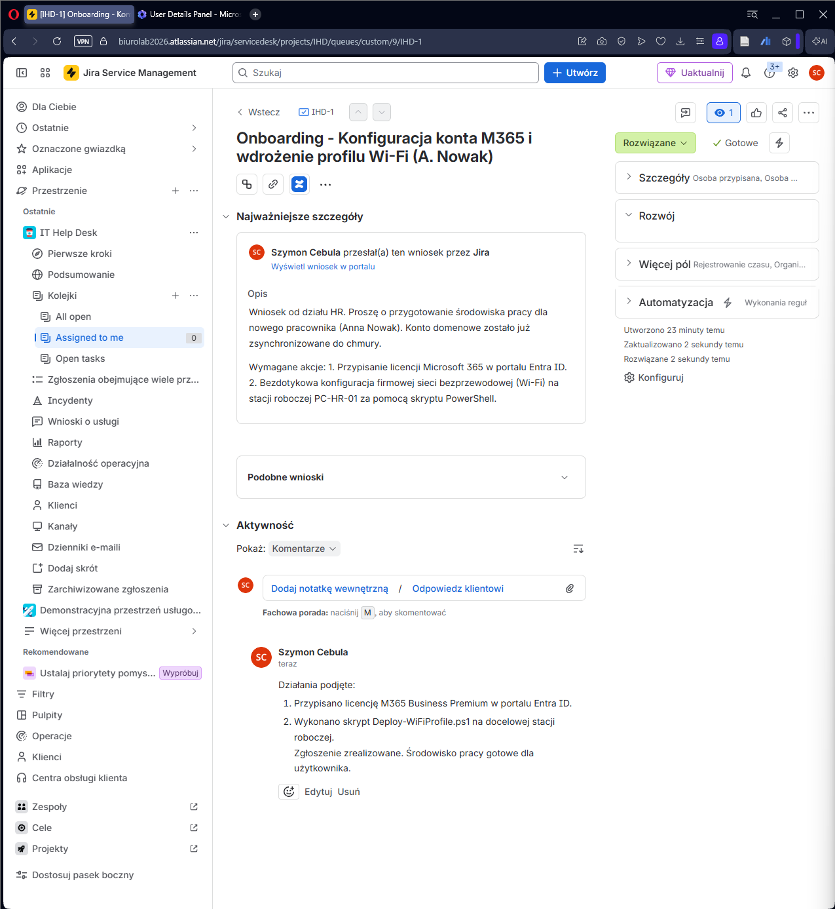

---

<b>📊 Podsumowanie i Wnioski</b>

Budowa projektu **Active-Directory-HelpDesk-HomeLab** od zera pozwoliła mi zrozumieć cykl życia środowisk opartych o systemy Microsoft oraz powiązane z nimi ryzyka bezpieczeństwa. 

* **Kompleksowe zarządzanie tożsamością:** Przeszedłem ścieżkę od ręcznego ustawiania przez interefejs graficzny, przez masowe skrypty PowerShell, aż po zabezpieczenia na poziomie lokalnych grup administracyjnych.
* **Praktyczny Troubleshooting:** Doświadczyłem i rozwiązałem realne problemy środowiskowe: od limitu znaków w oknie "Uruchom" blokującego payloady, przez formatowanie kodowania UTF-8 psujące parsowanie JSON-ów, aż po blokady zapory Windows Firewall uniemożliwiające zdalny odczyt zdarzeń (RPC).
* **Bezpieczeństwo Operacyjne (OPSEC):** Zrozumiałem na własnych błędach koncepcję wycieku sekretów. Zastosowałem  zmienne środowiskowe (`$env`), zachowując sterylną czystość repozytorium GitHub przy wdrażaniu kodu.
* **Blue Teaming to nie tylko SIEM z pudełka:** Opracowanie własnego narzędzia z wykorzystaniem cmdletu `Get-WinEvent` pokazało mi, z jak ogromną ilością surowych danych (Event IDs, struktury SID) musi mierzyć się analityk bezpieczeństwa, by wygenerować przydatny biznesowo alert.

